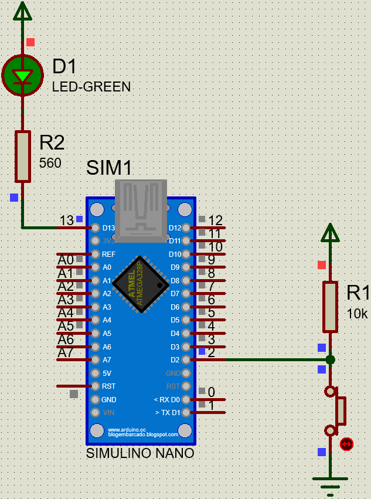

# Simples IO

## Biblioteca para configurar de forma simples os IOs do Arduino - versão 1.0.1

Inclusão:
- Exemplo no proteus

### Exemplo:



```

/*
Simples IO
*/

#include <Simples_IO.h>

IN IN1(2);
OUT OUT1(13);

void setup() {

  OUT1.OFF();

}

void loop() {

  //IN0 read
  if(!IN1.readPin())
    OUT1.OFF();
  else
    OUT1.ON();            
}

```

Para adicionar a biblioteca, faça o download e na IDE do Arduino, vá em:
Sketch->Include Library->Add .ZIP Library "local da biblioteca .zip"

### Essa biblioteca permite os seguintes métodos:
```
.ON() - Coloca o pino em "alto"
.OFF() - Coloca o pino em "baixo"

.readPin() - Retorna o nível lógico presente no pino
.getState() - Retorna o atual nível lógico da saída
```
